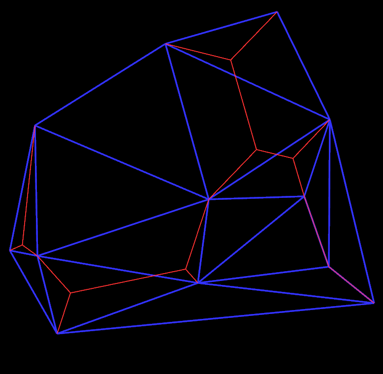
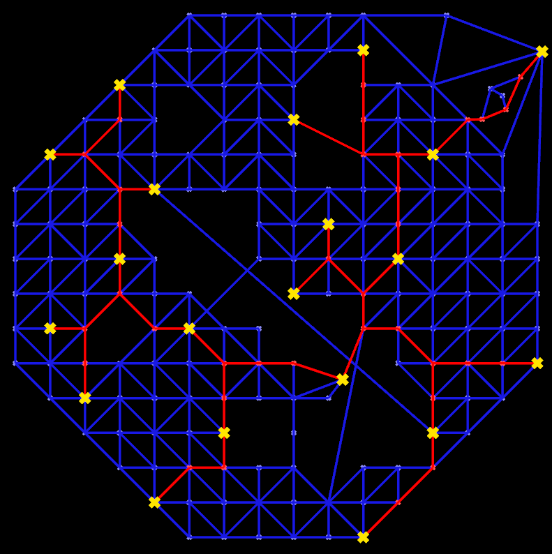

# two-steiner-tree-algorithms-in-java

Two algorithms in Java for building Steiner trees:  one that accepts a list of unconnected points in the Euclidean plane and efficiently connects them with a tree, and one that accepts an undirected graph with weighted edges and a list of some of the graph's vertices, whereupon it efficiently connects those particular vertices with a tree-shaped subgraph (or failing that, a forest-shaped subgraph) of the input graph.

# Algorithm One

This algorithm takes in a list of <float, float> coordinate pairs and returns a graph representing a Steiner tree efficiently connecting those points in the Euclidean plane.  In the course of its work it also creates a Delaunay triangulation of the points, and this may also be returned as a graph without additional cost.

### Data Structure

Both graphs are represented as doubly connected edge lists, which means that each Edge object in one of these graphs is actually a "half-edge", with that Edge and its corresponding Edge.opposite object together representing one entire edge.  I think I may have deviated from the norm a bit in my implementation of this data structure, by including in a half-edge pointers not to its successor and predecessor about a face, but rather to its left and right successors about the left and right neighboring faces.  But given these links, it is straightforward to find an edge's more conventional "successor" and "predecessor" in O(1) time, so I think this should not be a serious problem for anybody.  (Specifically, the successor is simply leftSuccessor, whereas the predecessor may be obtained via DCELGraph.Edge.leftPredecessor().)

Within one of these graphs, outgoing edges are arranged about their source vertex in counter-clockwise order, except where degeneracies produce ambiguity in which case the outgoing edge order is unspecified.  Likewise, edges are arranged about faces in counter-clockwise order.  Faces, however, are not explicitly represented.

### Strategy and Performance

The basic algorithm used here is a modification of an "Incremental Optimization Heuristic" presented in "Two Heuristics for the Euclidean Steiner Tree Problem" by Derek R. Dreyer and Michael L. Overton (June 11, 1997); this version greatly reduces the running time of the original algorithm by first computing a Delaunay triangulation, which it then traverses, whenever a vertex is to be added to the growing Steiner tree, in order to find edges in the tree that are "near" enough to the new vertex to serve as potential linking sites where that vertex may join the tree - the original algorithm would consider every edge in the tree to be a potential linking site, so if the maximal degree of a vertex in the triangulation is not too great, then this modification may remove something like a O(n) factor from the running time.

Degenerate edges (between input points that lie atop one another) are handled according to the caller's preference, as specified via the SteinerDuplicatePointPolicy parameter.  There are two choices:  Either collapse each set of equal input points into one output vertex, or turn EVERY input point into an output vertex no matter what, with only one vertex in each set of coincident ones being used to build the main tree, while the rest are hung upon that one via zero-length edges (which will still of course form a tree).

A few numerical tuning parameters are optionally accepted, for improving the quality of the algorithm's result, the speed with which it runs, or (occasionally) both at once.  For a little more detail on these, see the comment on DCELGraph.makeSteinerTreeAndDelaunayTriangulation().

No rigorous analysis of the algorithm's performance is offered here.  It does an okay job I think!  If you give it a small-ish point set it should be quite fast.  It can work well for large inputs too, but is not really optimized for memory usage; very large input sets will cause stack overflow or heap overflow errors.

### Examples

Example code may be found in the PlanarTreeExample class.  I didn't include any drawing code to draw the output tree; the example just lists out the tree's edges via the console.  But if you happen to be familiar with Mathematica, you can turn on the produceMathematicaCode flag in the example to get a graphics directive that will make Mathematica draw the graph for you!  Or just use your own drawing code.  :)

(Also note that if you aren't familiar with Mathematica, but are feeling mildly adventurous, you can go sign up at www.wolframcloud.com, start a "new notebook", paste the example's output into the notebook, and press shift-Enter to get the graphs anyway.  No this is not an advertisement for Wolfram Research, I just didn't want to mess with Java 2D let alone OpenGL for this project.)

The image above shows another example of the algorithm's output.  In the image, the blue graph is the Delaunay triangulation, and its vertices are the input points.  The red graph is the Steiner tree, and so, naturally, some of its vertices are NOT input points.

# Algorithm Two

This algorithm takes in an undirected graph with weighted edges and a list of indices to vertices of that graph, and leaves marks within the graph (on both its vertices and edges) in order to "draw" a forest-shaped (and if possible, tree-shaped) subgraph of approximately minimal weight that connects together all the indexed vertices within each connected section of the graph that contains some of them.  (So it is okay to pass in a disconnected graph.)

### Data Structure for the Graph

The graph representation used here is an "edge arrays graph" (represented by the class EdgeArraysGraph), not the DCEL used by Algorithm One.  This is a simple structure:  The graph holds an ArrayList of vertices; each vertex holds an ArrayList of its incident edges (listed in no particular order); and each edge holds pointers to its two terminating vertices.  Unlike in the DCEL, Edge class instances in this structure represent entire edges, not half-edges.

The "mark" added by the Steiner subgraph algorithm is stored in one bit of a primitive integer field; each of the Vertex and Edge classes has such a field.  (The same system exists in DCELGraph, actually, and it works the same way there.)  The bits in the field may be set, read, or cleared via methods on these classes; each of the methods takes a mark index as a parameter.  This is used to select which bit will be dealt with.  Naturally the size of the underlying field limits the number of legal indices; it is the caller's responsibility to keep the indices small enough (and non-negative).  All marks are set to zero by default.

### Usage and Algorithmic Structure

The EdgeArraysGraph.markSteinerSubgraph() method takes in a mark index as one of its parameters, allowing the caller to choose which mark will be used to draw the Steiner forest.  The mark at this index will also be used internally by the algorithm to temporarily tag portions of the graph for various reasons, so it is expected that all edges and vertices that will be handled by the algorithm during its execution will not have their mark bits at this index turned on when the method is called.  It is not specified here which particular edges and vertices those will be, implying that the mark at the specified index should be set to zero in ALL the graph's components when the call is made, in order for correct behavior to be guaranteed.  Since there are plenty of mark indices, this shouldn't be a serious handicap.

The markSteinerSubgraph() method also accepts an interruptionSignal parameter that provides the caller with a way to stop the algorithm early and discard its potential result.  If the function is interrupted then it may leave the graph in a partially marked state; if the graph itself is not to be discarded, then clearing the specified mark on all its edges and vertices may be necessary.  Though this mechanism is intended for use in a multithreaded program, the signal object is not treated specially with respect to synchronization; its methods are called naively, and if any special synchronization is desired then the interruptionSignal object must manage it internally.  The interruptionSignal argument may not be null; if interruption is not desired, then NullInterruptionSignal.instance (or something else behaving like it) must be passed in.

That naturally leads to an explanation of the general structure of the algorithm, and of the reason why it might sometimes be slow enough to warrant early interruption.  Like the planar Steiner tree algorithm presented above, this one builds each tree incrementally; when it adds a new terminal vertex to the tree, it aims to perhaps split some existing segment of the tree, producing a new Steiner vertex to which the new terminal may be anchored.  Unlike that algorithm, this one generally cannot use a Delaunay triangulation to find "nearby" parts of the tree to potentially split, because it is designed to work on all weighted, undirected graphs, not only distance-weighted graphs arranged within Euclidean space.  (It could conceivably contain special-case clauses allowing it to behave in that way when given such a graph, but it does not.)  Instead, it relies on a global search for the lengths of shortest paths between all pairs of vertices in the graph to give it information about what parts of the tree may be "nearby" and about whether one tree alteration produces a smaller tree than another does.  To produce this information, it prepares to invoke Dijkstra's algorithm on every vertex in the graph (but then does not actually do so), and lazily advances each of these stored invocations as needed.  In the worst case, the entire graph may end up being searched in this way, producing for the entire algorithm a running time worse than the ideal running time of one Dijkstra's algorithm execution per vertex (which happens to be O(|E||V| + |V|^2 log|V|) where E and V are the sets of edges and vertices respectively).  This is rather worse than the O(n log(n)) ideal running time of a Delaunay triangulation algorithm, and it is the cause of much of this algorithm's slowness, when the algorithm is slow.  (Playing around with tuning parameters can still greatly affect its speed though!)

For example, on this author's computer (with CPU running at 4.2 Ghz) a particular graph that holds 8192 approximately evenly spaced vertices within a square area in the plane, with an approximate Delaunay triangulation connecting them (but with a few edges randomly removed), and with 10 approximately evenly spaced terminal vertices marked, the algorithm takes about 4.6 seconds to produce a good result.  For a similar graph with only 32 vertices and 5 terminals, it runs in about 1 ms.  So, clearly the need for interruption can vary.

The markSteinerSubgraph() method also accepts a SteinerSubgraphOptions object containing the aforementioned tuning parameters.  If you don't care to tune, you can just create a new SteinerSubgraphOptions() and pass it right in - except in one respect.  It is required that at least one of the following be true:

* SteinerSubgraphOptions.maximalJumpDepthInMultipleVertexJiggling == 0
* SteinerSubgraphOptions.maximalMultipleVertexJumpCountPerPatch == Integer.MAX_VALUE
* SteinerSubgraphOptions.random != null

By default, this is not the case.  So, make sure to alter one of those values appropriately.  If your graph is small or its edges sparse, the Integer.MAX_VALUE option may be best.  If it's larger and you don't mind a bit of randomness (you can of course set the seed yourself), setting the random field may be best.  If you don't mind some potential loss in result quality, setting the maximal multiple-vertex jump depth to zero may be a good option.

Otherwise, the default options should be at least decent in many situations.  Still, you are encouraged to play around with their values.  For a more thorough explanation of their meanings, see the long, rambling comment above EdgeArraysGraph.markSteinerSubgraph().

This algorithm is not optimized especially well for low memory usage.  On this author's machine, with the default JVM heap size and stack size, it tends to run into trouble (in the form of out-of-memory errors) at around 10,000 vertices and 30,000 edges per graph, though this will vary substantially from one set of inputs to another.  It could certainly be improved in this respect; extending those memory limits via JVM arguments would of course be a cheap workaround.

### Examples

Several pieces of example code have been provided to show the basic use of this algorithm.  They may be found in the several Subgraph*Example classes:

* Subgraph2DExample uses the EuclideanVertex, EuclideanEdge, and PlaneVector classes to embed a grid-shaped graph in the Euclidean plane and then build a simple Steiner subgraph in it.

* Subgraph3DExample uses the EuclideanVertex, EuclideanEdge, and SpaceVector classes to embed a grid-shaped graph in 3D Euclidean space and then build a Steiner subgraph in it.

* SubgraphArbitraryWeightsExample uses custom vertex and edge classes to build a grid-shaped graph that basically lies in the Euclidean plane (though it needn't do; this just makes it more convenient to draw), but that uses whatever arbitrary edge-weighting scheme is passed into its creation function.  Four different Steiner subgraphs are produced, using four different weighting schemes that give the trees strikingly different shapes.

* SubgraphManhattanDistanceExample uses EuclideanVertex and PlaneVector to build a graph in the plane, but also uses an optional custom edge class to show one possible effect of building a Steiner subgraph under a non-Euclidean distance measure.  Its output shows the original graph, a Steiner subgraph built with the Euclidean measure, and a Steiner subgraph built with the Manhattan measure.

As with Algorithm One above, I didn't include any drawing code to draw these output graphs; the examples just lists out the graphs'/subgraphs' edges via the console.  But if you happen to be familiar with Mathematica, you can turn on the produceMathematicaCode flag in any example to get a graphics directive that will make Mathematica draw the output for you (even the 3D subgraph)!  Or just use your own drawing code.  :)

(Also as above:  Note that if you aren't familiar with Mathematica, but are feeling mildly adventurous, you can go sign up at www.wolframcloud.com, start a "new notebook", paste the example's output into the notebook, and press shift-Enter to get the graphs anyway.  No this is not an advertisement for Wolfram Research, I just didn't want to bother with putting some brittle drawing code in here and also I like Mathematica.)

As one more example, the image above shows the algorithm's output for an arbitrary graph in the Euclidean plane.  In the image, the blue graph is the original input graph, the yellow-marked vertices are input terminals, and the red edges belong to the Steiner subgraph.
